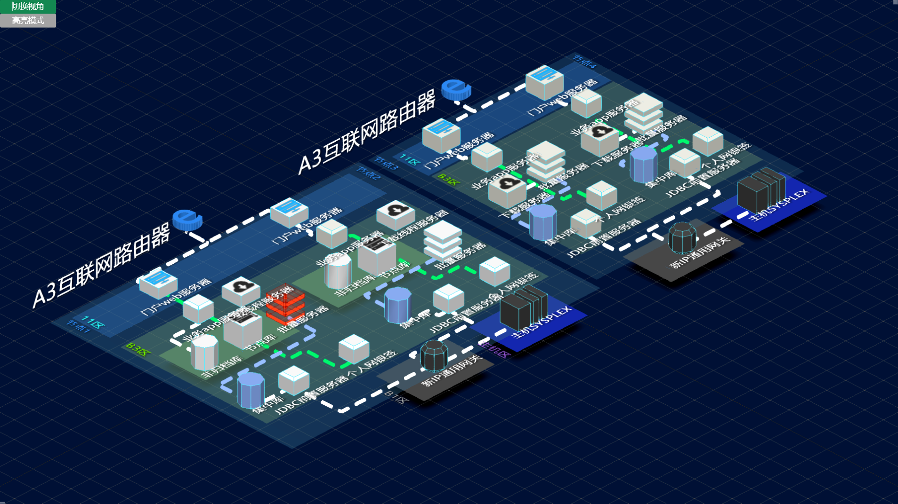

# ADGE 
- 一个基于Threejs的三维数据可视化工具
- 拥有编辑与展示模式,使用json保存/导入/导出
- 支持模型导入与自定义shader,支持接入api改变节点

---
## 使用概要

adge 使用 4 种类型的图元，用以可视化的方式编辑流程图
分别是节点、连线、平面、文字

### 全局功能

- 鼠标按住拖动元素
- 按住 shift 同时按住鼠标拖动编辑器面板
- 在编辑器左侧节点增删图元，新增图元位于画面中心
- 点击图元选中将会切换编辑器到对应标签
- 任意图元的编辑会自动保存到平台组件数据中

## 各组件功能

### 组件面板-样式

- 背景颜色: 编辑器底部颜色
- 网格颜色: 编辑器定位网格颜色
- 相机高度: 设置编辑器的俯视高度
- 阴影强度: 调节 3d 光照的效果强度
- 导入: 组件的当前场景保存的序列化数据

### 节点

节点逻辑上为一个点，可以接入数据集为自己更新状态，可以弹窗

- 名称: 节点名称从编辑器左侧对应节点命名获取，显示在模型下方
- 属性: 用于数据接入，接受一个数组，均为可选
  - 格式: `[数据,弹窗状态,弹窗标题,弹窗内容,弹窗附带URL]`
    - 数据: `number`
      - 节点的数据，配置了阶段状态以后可以连动修改显示样式
    - 弹窗状态: `enum:{"red","yellow","green"}`
      - 弹窗颜色红黄蓝三个状态
    - 弹窗标题/弹窗内容/弹窗附带 URL: `string`
      - 略
- 样式: 节点视觉样式
  - 主属性
    - 形状: 内置的几种节点显示模型
    - 名称: 会被左侧编辑器节点名覆盖，现阶段无用
    - 模型导入: 节点的 3D 模型，支持 obj 格式
    - 贴图导入: 节点的顶端贴图导入
  - 3d 样式
    - x\y\z 缩放: 控制模型/贴图大小
    - 文字偏移: 控制节点名显示位置
    - 位置: 模型的坐标位置，可以拖动也可以输入，格式不合法将被丢弃
  - 阶段状态
    - 节点可以通过 `属性`->`数据` 的值改变显示状态
    - 当节点数据高于 `基准值x` 将切换 `颜色x\描边颜色x` 的样式

### 平面

在流程图上显示一个范围

- 样式
  - 位置: 同节点的位置，双向绑定
  - 贴图导入: 支持导入图片以显示更多信息，会被颜色属性染色
  - 宽度\长度: 平面的大小，按住 ctrl 拖动鼠标亦可以控制，双向绑定
  - 其余: 略

### 文字

流程图上的文字元素，显示内容与编辑器节点名称一致

- 样式
  - 文字: 会被左侧编辑器节点名覆盖，现阶段无用
  - 位置: 同节点的位置，双向绑定
  - XYZ 旋转: 调节文字的方向，`跟随视角`将随着编辑器镜头转动
  - 其余: 略

### 连线

- 按住 shift 点击两个节点，自动生成连线与对应的编辑器节点

- 通过编辑器节点直接添加的连线无效，不会显示

- 连线有 直线/折线 两种样式,在 `样式` -> `折线` 中切换
- 折线生成时带有两个红色端点，可以用鼠标拖动，来改变折线形状
- 端点会自动增加，以适应任意线路

### 左上角按钮区

- 保存场景

  导出当前场景的数据到 `组件`->`样式`->`导入` 的数据，用于强制保存

- 切换视角

  切换摄像机镜头

- 高亮模式

  鼠标指向的节点所属的线路将会亮起，其他节点变淡

---

## 附录

### 导入格式

输入为一个 JSON 数组
包含类型

- 节点: `Node`
- 节点关系: `Line`

### Node 节点

- type:"Node"
  - 类型声明
- uuid:
  - 全局唯一的任意字符串
- name:
  - 节点名称，会显示在节点边
- color?:
  - 节点显示颜色
- lineColor?:
  - 节点模型描边颜色

### Line 节点关系

- type:"Line"
  - 类型声明
- startID:
  - 自身起点的点`uuid`
- endID:
  - 自身终点的点`uuid`
- color?:
  - 连线显示颜色
